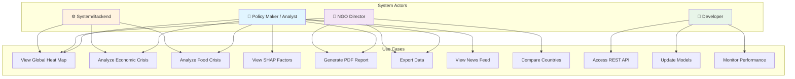

```mermaid
graph TB
    subgraph Actors["System Actors"]
        PM["👤 Policy Maker / Analyst"]
        NGO["👤 NGO Director"]
        DEV["👤 Developer"]
        SYS["⚙️ System/Backend"]
    end

    subgraph UseCases["Use Cases"]
        UC1["View Global Heat Map"]
        UC2["Analyze Economic Crisis"]
        UC3["Analyze Food Crisis"]
        UC4["View SHAP Factors"]
        UC5["Generate PDF Report"]
        UC6["Export Data"]
        UC7["View News Feed"]
        UC8["Compare Countries"]
        UC9["Access REST API"]
        UC10["Update Models"]
        UC11["Monitor Performance"]
    end

    PM --> UC1
    PM --> UC2
    PM --> UC3
    PM --> UC4
    PM --> UC5
    PM --> UC6
    PM --> UC7

    NGO --> UC1
    NGO --> UC8
    NGO --> UC5
    NGO --> UC6

    DEV --> UC9
    DEV --> UC10
    DEV --> UC11

    SYS --> UC1
    SYS --> UC2
    SYS --> UC3

    style PM fill:#e1f5ff
    style NGO fill:#f3e5f5
    style DEV fill:#e8f5e9
    style SYS fill:#fff3e0
```
