USE CASE DIAGRAM

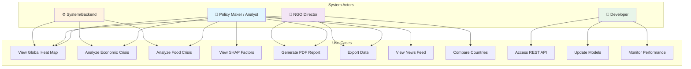

USE CASE DIAGRAM DETAILED VERSION:

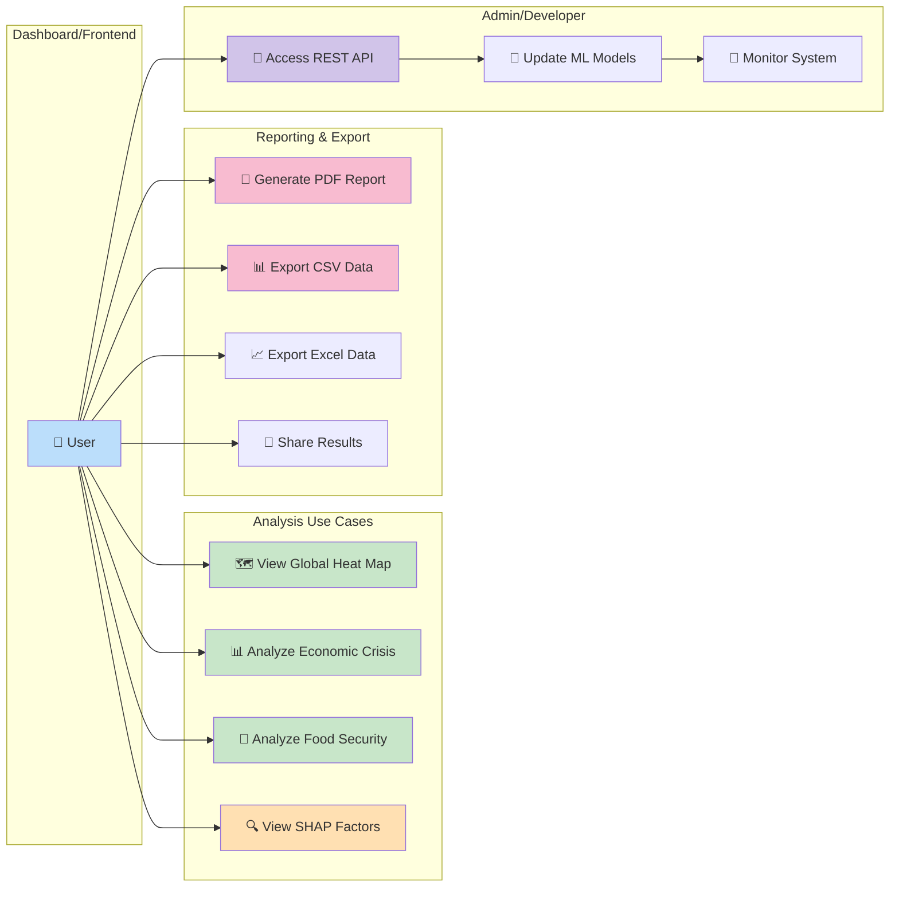
Activity flow diagram

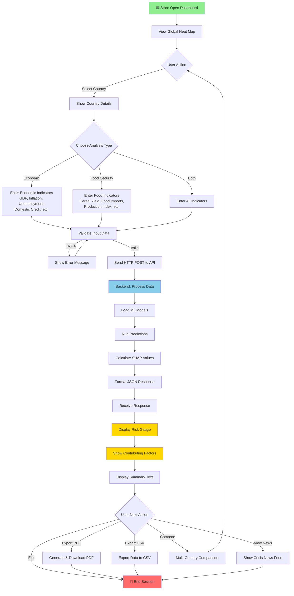

Class diagram

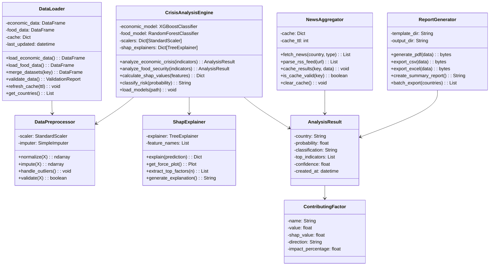

component architecture diagram

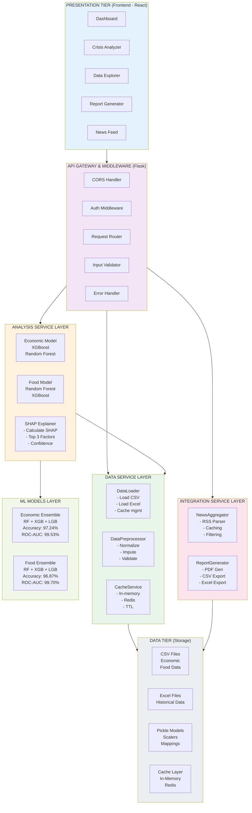

data model

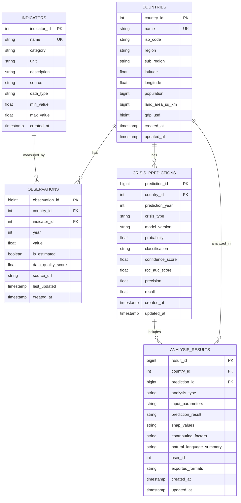

Data loading diagram

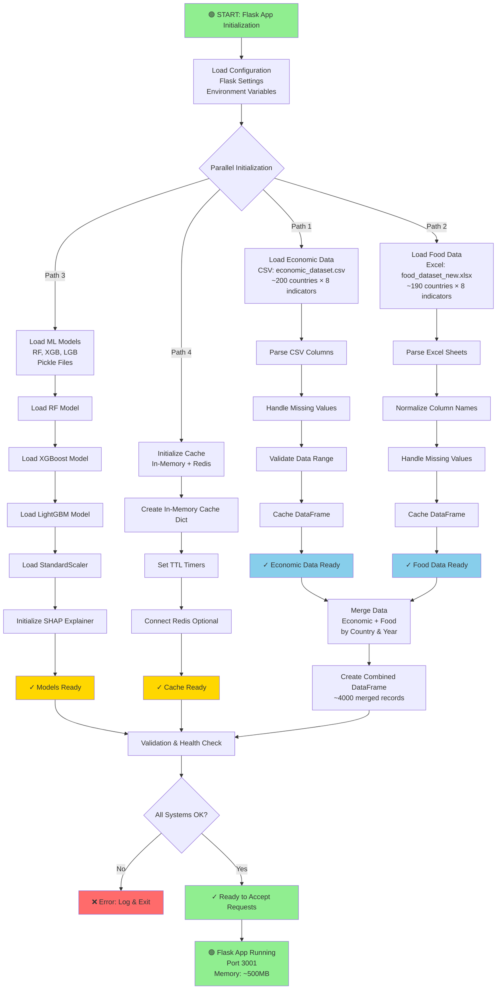

complete data analysis diagram

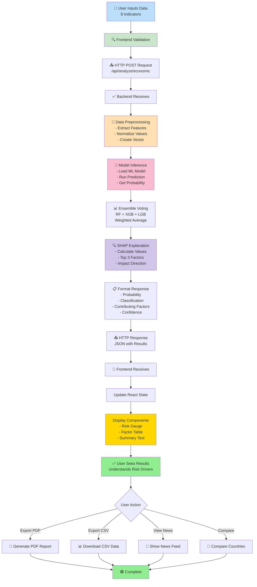

Data analysis diagram ( detailed)
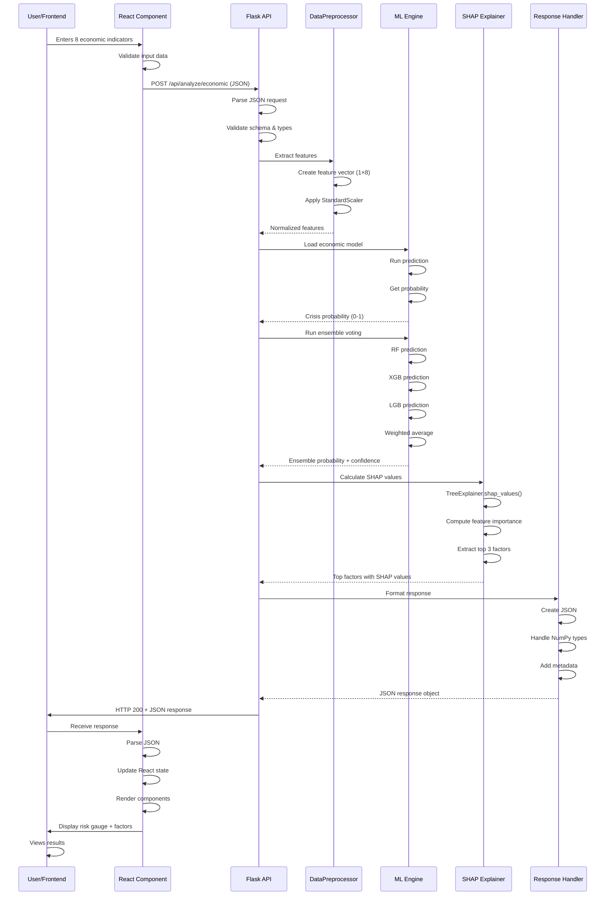

system architecture 

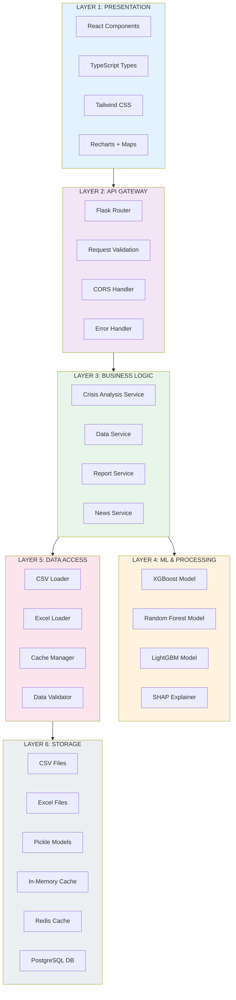

model performance comparsion

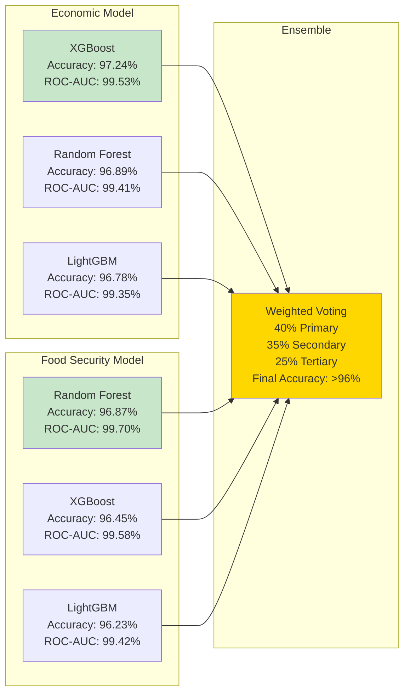

end points overview

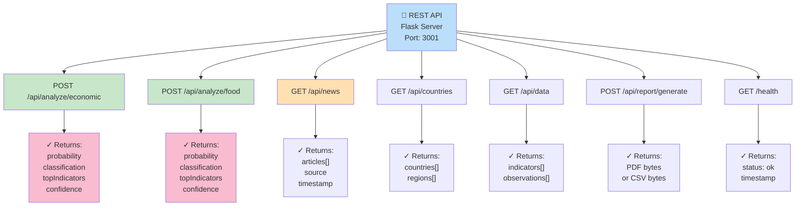
