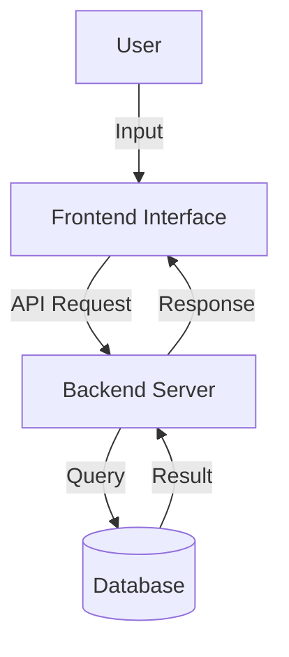
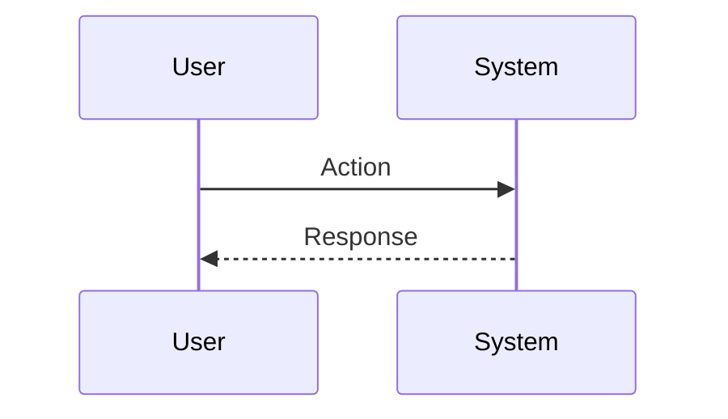

# [Project Title]

> [!NOTE]
> This document serves as a template. Please replace all bracketed text `[...]` and placeholders with actual project content.

## Abstract
[Insert Abstract here. Briefly summarize the problem statement, the proposed solution, the methodology adopted, and the key results obtained. This section should provide a high-level overview of the entire project.]

## 1. Introduction
[Provide background information, context, and the motivation for the project.]

### 1.1 Problem Statement
[Clearly define the problem that this project aims to solve.]

*   [Key Issue 1]
*   [Key Issue 2]

### 1.2 Objectives
[List the primary objectives of the project.]

1.  [Objective 1]
2.  [Objective 2]
3.  [Objective 3]

## 2. Literature Survey
[Summarize related work, existing solutions, and research papers relevant to the project.]

| Author(s) | Year | Title | Key Findings / Methodology |
| :--- | :--- | :--- | :--- |
| [Author Name] | [Year] | [Paper Title] | [Brief summary of the approach and findings] |
| [Author Name] | [Year] | [Paper Title] | [Brief summary of the approach and findings] |
| [Author Name] | [Year] | [Paper Title] | [Brief summary of the approach and findings] |

## 3. Flow Diagram / Architecture
[Describe the overall system architecture and the flow of data/control.]

### 3.1 System Architecture
[Explain the high-level architecture.]



### 3.2 Data Flow
[Explain how data moves through the system.]



## 4. Methodology
[Detail the methods, algorithms, and technologies used to implement the solution.]

### 4.1 Proposed Approach
[Describe the approach taken to solve the problem.]

### 4.2 Algorithms / Logic
[Explain key algorithms or logic blocks.]

```python
# Placeholder for key algorithm logic
def core_algorithm_placeholder(input_data):
    """
    Description of what this algorithm does.
    """
    # Step 1: Process input
    processed_data = input_data * 2
    
    # Step 2: Return result
    return processed_data
```

## 5. System Testing
[Describe the testing strategy, test cases, and validation methods.]

### 5.1 Test Plan
*   **Unit Testing**: [Description of unit tests]
*   **Integration Testing**: [Description of integration tests]
*   **User Acceptance Testing**: [Description of UAT]

### 5.2 Test Cases

| Test Case ID | Description | Expected Outcome | Actual Outcome | Status |
| :--- | :--- | :--- | :--- | :--- |
| TC-001 | [Test Description] | [Expected Result] | [Actual Result] | [Pass/Fail] |
| TC-002 | [Test Description] | [Expected Result] | [Actual Result] | [Pass/Fail] |

## 6. Results & Discussions
[Present the results obtained from the system execution and discuss their significance.]

> [!TIP]
> Use charts and graphs to visualize performance metrics or data analysis results.

### 6.1 Performance Metrics
*   **Metric A**: [Value]
*   **Metric B**: [Value]

### 6.2 Analysis
[Discuss what the results imply. Are they in line with expectations?]

## 7. Demonstration of Prototype
[Provide evidence of the working prototype, such as screenshots or usage scenarios.]

### 7.1 Screenshots


*Figure 1: Main Dashboard Interface*


*Figure 2: Feature X in Action*

## 8. Future Works
[Discuss potential improvements, features that could be added, or research directions for the future.]

*   [Improvement 1]
*   [Improvement 2]

## 9. Conclusion
[Summarize the project, reiterating the problem, the solution, and the final outcome.]

## 10. References
[List all references cited in the document.]

1.  [Author Names]. "[Paper Title]." *[Journal/Conference Name]*, [Year].
2.  [Author Names]. "[Book Title]." *[Publisher]*, [Year].
3.  [Website Name]. "[Page Title]." [URL]. Accessed [Date].

---
*Document generated on 2025-12-01*
