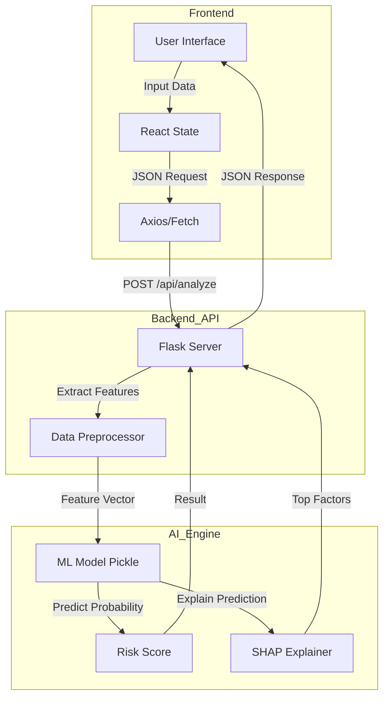
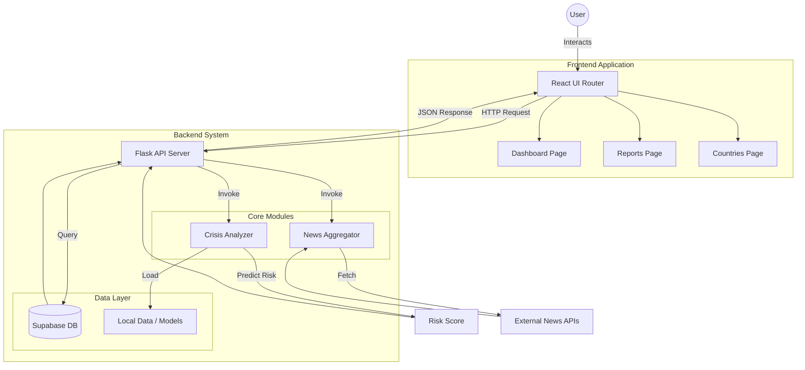
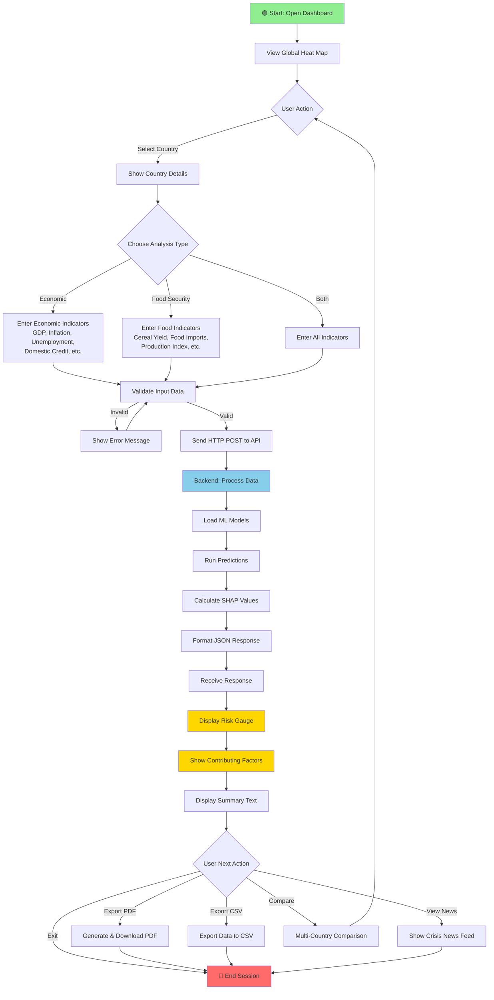
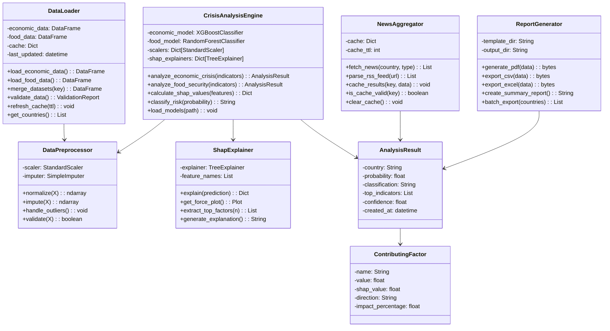
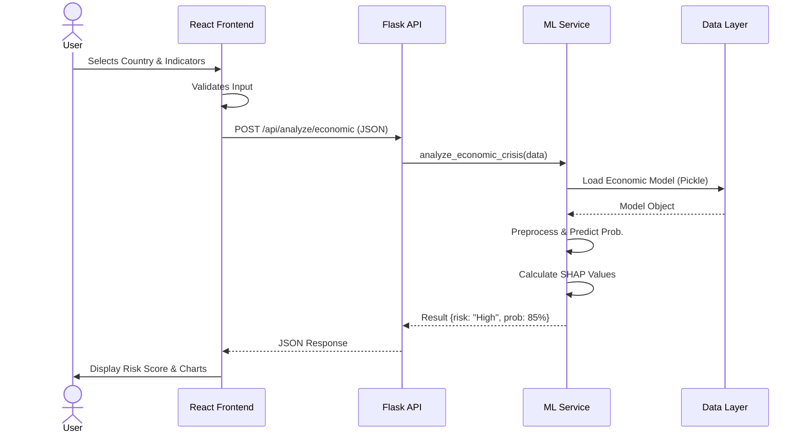
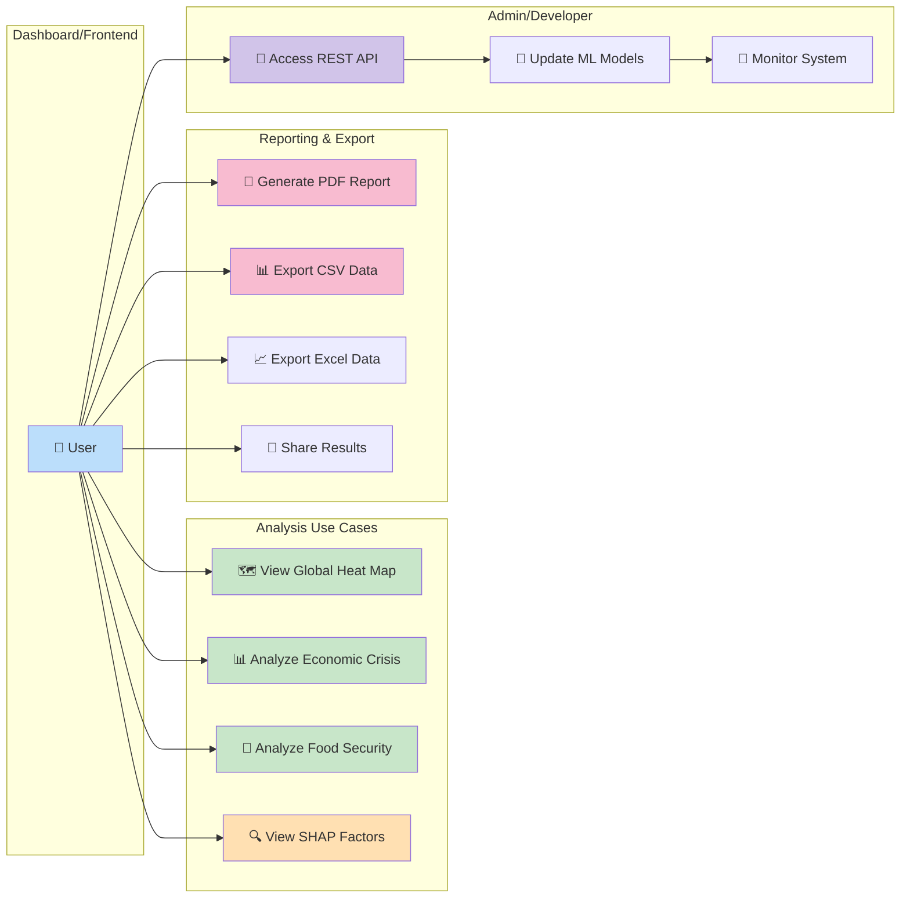

# Global Socio-Economic Crisis Dashboard (GSECD) 🚨🌍

[](https://www.python.org/)
[](https://nodejs.org/)
[](#license--acknowledgements)

**A comprehensive web platform to visualize, analyze, and forecast economic and food security crises worldwide.**

> Quick Start: `npm install && npm run dev` (frontend) and `cd supabase && python -m pip install -r requirements.txt && python app.py` (backend)


---

## Table of Contents 🧭

- [Project Overview](#project-overview)
- [Features](#features)
- [Architecture & Diagrams](#architecture--diagrams)
- [Quick Start](#quick-start)
  - [Frontend (Dev)](#frontend-dev)
  - [Backend (Flask API)](#backend-flask-api)
- [Configuration & Environment Variables](#configuration--environment-variables)
- [Data Sources & Models](#data-sources--models)
- [Testing & Validation](#testing--validation)
- [Troubleshooting](#troubleshooting)
- [Contributing](#contributing)
- [License & Acknowledgements](#license--acknowledgements)

---

## Project Overview ✨

GSECD (Global Socio-Economic Crisis Dashboard) is a Single Page Application (SPA) that aggregates global socio-economic and food-security indicators, visualizes them on interactive maps and charts, and provides ML-powered risk predictions and explainability (SHAP). The app aims to help policymakers, NGOs, and researchers monitor, analyze, and act on emerging crisis risks.

Key outcomes:
- Intuitive **Global Heat Map** for at-a-glance risk monitoring
- **Crisis Analyzer** with probabilistic risk scores and SHAP explanations
- **Latest News** feed (RSS-based) for situational awareness
- Exportable **PDF/CSV** reports and multi-country comparisons

---

## Features ✅

- Interactive map-based visualization (React + react-simple-maps)
- Crisis analysis endpoints (Flask API) using ensemble ML models
- SHAP-based factor explanations for model predictions
- News aggregation via Google News RSS (fallback demo data available)
- PDF and CSV export functionality
- Responsive design, dark mode, and accessible UI

---

## Architecture & Diagrams 🏗️

The project follows a classic presentation → API → analysis pipeline:

- Frontend: React (Vite) — UI, maps, charts, routing
- Backend: Flask — API endpoints, model inference, news aggregation
- Models / Research: Python scripts, pickle models, SHAP explainers
- Data: Local CSV datasets, Supabase DB for storage and auth

For detailed diagrams, see `Diagrams.md` (includes Mermaid diagrams):

- Use Case Diagram
- Activity & User Flow
- Class, Component, and Data Model Diagrams

Quick architecture (Mermaid):



---

## Quick Start ⚡

### Prerequisites
- Node.js (v18+ recommended) and npm
- Python 3.10+ (virtualenv recommended)
- Git

### Frontend (Development)

```bash
# from project root
npm install
npm run dev
# open http://localhost:5173
```

Type check & tests (frontend):

```bash
npx tsc --noEmit
npm run test      # runs vitest
```

### Backend (Flask API)

```powershell
# Windows PowerShell example
# activate venv if present
& .\venv\Scripts\Activate.ps1
cd supabase
python -m pip install -r requirements.txt
python app.py
# Flask will run on http://localhost:3001
```

Endpoints of interest:
- `GET /health` — health & module status (includes `news` status)
- `POST /api/analyze/economic` — economic analysis (JSON input)
- `POST /api/analyze/food` — food analysis (JSON input)
- `GET /api/news/latest` — latest global crisis news

---

## Configuration & Environment Variables 🔧

- Frontend
  - `VITE_API_URL` — base URL for the API (default `http://localhost:3001`)
- Backend/News
  - No API key required for the RSS-based news integration (uses Google News RSS). If you later integrate a 3rd-party provider, add `NEWS_API_KEY` as needed.

Note: The news module may fall back to demo data when RSS fetch fails; check `/health` `news` field and server logs for `News API module not loaded` or related errors.

---

## Data Sources & Models 📚

- Data: `supabase/data` and `data/` contain CSV datasets used for training and display.
- Models: `supabase/models/` contains pickled model artifacts and research notebooks (`model1.ipynb`, `model2.ipynb`).
- Research scripts: `supabase/research/` contains evaluation, explainability, and report generation utilities.

---

## Testing & Validation ✅

- Frontend: `npm run test` (Vitest) and `npx tsc --noEmit` for type checking
- Backend: `supabase/test_api.py` is a simple script to exercise endpoints (run while Flask is active)

---

## Troubleshooting 🛠️

- News returns `status: 'error'` with message `News API module not loaded`:
  - Ensure `feedparser` is installed in the backend venv: `python -m pip install feedparser`
  - Restart the Flask server and check `/health` — `news` should be `loaded`
  - Server logs will print either `✅ Successfully imported news API functions` or a detailed ImportError
- If Google News RSS returns 0 articles often, the RSS feed may be rate-limited or filtered; the system will return demo data in that case.

---

## Diagrams & Reports 📄

- `Diagrams.md` — full collection of Mermaid diagrams (use case, activity flow, class diagram, component architecture, ER diagram)
- `PROJECT_REPORT.md` and `Reports/PROJECT_REPORT.md` — detailed project reports and results

### Diagrams Gallery 🖼️

Below are the main architecture diagrams. For more, open the files directly or view `Diagrams.md` for the raw Mermaid definitions.

**Workflow Overview**



**Activity Flow**



**Class Diagram**



**Data Flow**



**Use Case Diagram**



---

## Contributing 🤝

We welcome contributions. Suggested workflow:

1. Fork the repo
2. Create a feature branch: `git checkout -b feat/your-feature`
3. Implement and add tests
4. Open a pull request with a clear description

Please follow the repository coding style and add unit tests for new functionality.

---

## License & Acknowledgements 🧾

This project does not include a License file yet. If you want to make this open source, consider adding an `MIT` or `Apache-2.0` LICENSE file.

Thanks to the research team and contributors for data collection and model design.

---


